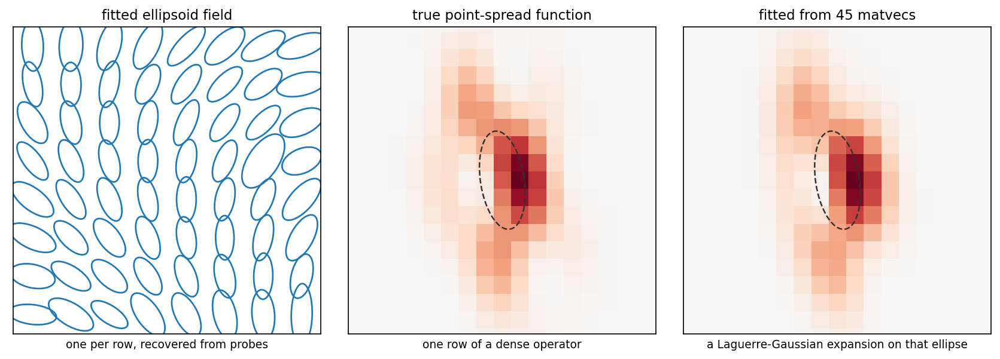

# lgpsf

Recover a large, dense, high-rank, matrix-free operator using only
its action on random vectors.

Header-only C++17, with Python bindings.



## What it is for

Some operators can be applied but not inspected. The Gauss-Newton Hessian of a
PDE-constrained inverse problem is the canonical case: one application costs a
linearized forward solve plus an adjoint solve, and there are `n²` entries you
will never enumerate. The same situation occurs whenever applying an operator
hides an expensive subproblem.

If such an operator has **local smooth point-spread functions**,
each row concentrated near its own node, lgpsf recovers it from a few dozen applications:

- probe with random vectors `V`, collect `HV`;
- fit each row as a **Laguerre-Gaussian expansion on its own fitted ellipsoid**,
  by variable projection;
- deploy the result as a sparse matrix, a matvec, or a kernel you can evaluate
  anywhere.

The probe count does not grow when you refine the mesh — a point-spread
function belongs to the continuum operator, not the discretization
([measured](experiments/mesh-scalability.md): a 16× increase in degrees of
freedom moved the budget from 63.9 probes to 64.3).

**If you can afford to form the dense matrix, you do not need this.**
Thresholding its small entries is simpler and exact.

## Example

```python
import lgpsf

# x       (2, K)     column points          m1, m2  (R,), (K,)  lumped masses
# sigma   (R, 2, 2)  a-priori ellipsoids    V       (k, K)      random probes
# HV      (k, R)     H @ V.T  -- the only thing the operator is ever asked for

config = lgpsf.OperatorFitConfig()
config.row.mode_policy = lgpsf.WedgeLadder(10, 2)

fit = lgpsf.fit_operator(x, m1, m2, V, HV, sigma, config=config)

A = lgpsf.assemble_sparse(fit.model, tau=6.0)   # a scipy sparse matrix
y = lgpsf.matvec(fit.model, v)                  # or apply it without assembling
```

`fit.diagnostics` carries per-row provenance — which rows shipped, how they
scored on held-out probes, and why the search stopped.

## Install

```
pip install lgpsf
```

For C++, add it with CMake `FetchContent` or `find_package`; it is header-only
and needs Eigen and [ellipsoid_tree](https://github.com/NickAlger/ellipsoid_tree).
See [docs/installation.md](docs/installation.md).

> ⚠️ **Compiling needs a lot of memory. Pick `-j` by RAM, not by core count.**
>
> Every translation unit instantiates Eigen templates heavily, and measured
> peak compiler memory here is **~3 GB per job** in a Release build and
> **~8 GB** under sanitizers. One job per core on a many-core machine can
> therefore exhaust RAM and invoke the OOM killer.
>
> Budget against FREE memory rather than total — roughly
> `(available GB - 4) / 3` jobs, and a single job for sanitizer builds. The
> failure mode arrives before the OOM killer: the machine swaps and the desktop
> locks up while the build carries on. See
> [docs/installation.md](docs/installation.md).

## Documentation

- **[Quickstart](docs/quickstart.md)** — the shortest path to a fit.
- **[API guide](docs/api-guide.md)** — the three layers, and the array
  conventions that trip people up.
- **[Defaults](docs/defaults.md)** — what the knobs are set to, and the
  evidence behind each.
- **[Validation](docs/validation.md)** — what this was tested against at field
  scale, and how it compares.
- **[Reproducibility](docs/reproducibility.md)** — what is bit-exact and what
  is not.
- **[Examples](docs/examples/)** — every example as a page: the program, its
  real output, and the figures it draws.

The mathematics is in
[docs/varpro-whitening-notes.pdf](docs/varpro-whitening-notes.pdf).

## Status

Alpha. The method is validated at field scale against a real PDE-derived
Hessian — see [docs/validation.md](docs/validation.md) — but the API is not
stable and the version is 0.1. Changes are recorded in
[CHANGELOG.md](CHANGELOG.md).

## Contributing

See [CONTRIBUTING.md](CONTRIBUTING.md). If you are proposing a change to the
method rather than the code, open an issue first. Those questions are usually
settled by measurement here, and the evidence is often already in
[docs/validation.md](docs/validation.md) or [experiments/](experiments/).

## Citing

There is no paper yet; cite the software. [CITATION.cff](CITATION.cff) has the
metadata, and GitHub renders it as a ready-made citation from the sidebar.

## License

MIT. See [LICENSE](LICENSE).
