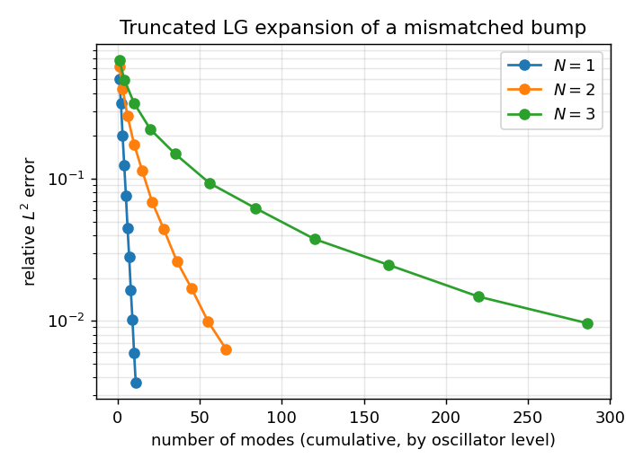

# Why a SHORT Laguerre-Gaussian expansion is worth fitting

The premise underneath the whole library: a smooth, localized bump is well
approximated by a handful of LG modes. Here that is checked directly, with no
fitting, no probes and no ellipsoid -- just inner products against an
orthonormal basis, one oscillator shell at a time.

    f(u) = exp(-|u - shift|^2 / (2 w^2)) * (1 + tilt . u)

deliberately mismatched to the basis: wider than the unit Gaussian the modes
are built on, off-center, and multiplied by a linear tilt. The coefficients
are just `c_i = <f, psi_i>`, because the modes are L2-orthonormal -- which is
also a check on the basis itself, since a non-orthonormal basis would give
garbage this way.

The result is the tradeoff the mode ladder exists to navigate: error falls
fast with the number of modes, and the number of modes per shell grows with
dimension, so N = 3 buys the same accuracy far more slowly than N = 1.

## Figures



## Output

```text

N = 1   (grid 2001^1)
  level   modes   rel. L2 error
      0       1       5.067e-01
      1       2       3.373e-01
      2       3       2.021e-01
      3       4       1.236e-01
      4       5       7.638e-02
      5       6       4.523e-02
      6       7       2.814e-02
      7       8       1.641e-02
      8       9       1.020e-02
      9      10       5.905e-03
     10      11       3.658e-03

N = 2   (grid 301^2)
  level   modes   rel. L2 error
      0       1       6.151e-01
      1       3       4.301e-01
      2       6       2.764e-01
      3      10       1.749e-01
      4      15       1.133e-01
      5      21       6.868e-02
      6      28       4.437e-02
      7      36       2.633e-02
      8      45       1.690e-02
      9      55       9.914e-03
     10      66       6.318e-03

N = 3   (grid 81^3)
  level   modes   rel. L2 error
      0       1       6.881e-01
      1       4       4.994e-01
      2      10       3.401e-01
      3      20       2.220e-01
      4      35       1.496e-01
      5      56       9.304e-02
      6      84       6.199e-02
      7     120       3.757e-02
      8     165       2.474e-02
      9     220       1.478e-02
     10     286       9.621e-03

same ~1% accuracy costs 11 modes at N=1, 66 modes at N=2, 286 modes at N=3

wrote examples/lg_expansion_convergence.png
```

## Program

```python
import argparse
import os

import numpy as np

import lgpsf

MAX_LEVEL = 10
SETTINGS = {                 # dim: (grid points per axis, half width)
    1: (2001, 8.0),
    2: (301, 7.0),
    3: (81, 6.0),
}


def target(u):
    """The function being expanded, on a (N, K) point batch -> (K,)."""
    dim = u.shape[0]
    shift = 0.35 * np.arange(1, dim + 1) / dim
    tilt = 0.30 * np.ones(dim)
    r2 = ((u - shift[:, None]) ** 2).sum(axis=0)
    return np.exp(-r2 / (2.0 * 1.4 ** 2)) * (1.0 + tilt @ u)


def convergence(dim):
    """Relative L2 error against cumulative mode count, shell by shell."""
    resolution, half_width = SETTINGS[dim]
    axis = np.linspace(-half_width, half_width, resolution)
    weight = (axis[1] - axis[0]) ** dim          # tensor-product midpoint rule
    mesh = np.meshgrid(*([axis] * dim), indexing="ij")
    u = np.vstack([m.ravel() for m in mesh])     # (N, K)

    f = target(u)
    norm = np.sqrt(weight * (f @ f))

    # modes_up_to_level is the library's own enumeration -- the same order a
    # ShellLadder walks, and it already knows that N = 1 has no harmonics of
    # degree >= 2, so no dimension special-casing is needed here.
    modes = lgpsf.modes_up_to_level(dim, MAX_LEVEL)
    psi = lgpsf.eval_lg_basis(modes, u)          # (num_modes, K)
    coefficients = weight * (psi @ f)            # <f, psi_i>, orthonormality

    counts, errors = [], []
    for level in range(MAX_LEVEL + 1):
        keep = np.array([2 * m.p + m.ell <= level for m in modes])
        residual = f - coefficients[keep] @ psi[keep]
        counts.append(int(keep.sum()))
        errors.append(np.sqrt(weight * (residual @ residual)) / norm)
    return counts, errors


def main():
    parser = argparse.ArgumentParser(description=__doc__)
    parser.add_argument("--outdir", default="examples",
                        help="where to write figures")
    args = parser.parse_args()

    results = {}
    for dim in SETTINGS:
        counts, errors = convergence(dim)
        results[dim] = (counts, errors)
        print(f"\nN = {dim}   (grid {SETTINGS[dim][0]}^{dim})")
        print(f"  {'level':>5}  {'modes':>6}  {'rel. L2 error':>14}")
        for level, (count, error) in enumerate(zip(counts, errors)):
            print(f"  {level:>5}  {count:>6}  {error:>14.3e}")

    # Every shell must help, and 11 modes in 1-D reach what 286 need in 3-D.
    for dim, (counts, errors) in results.items():
        assert all(b < a for a, b in zip(errors, errors[1:])), \
            f"N={dim}: adding a shell should never increase the error"
        assert errors[-1] < 1e-2, f"N={dim} should reach 1% by level {MAX_LEVEL}"
    print(f"\nsame ~1% accuracy costs "
          + ", ".join(f"{results[d][0][-1]} modes at N={d}" for d in results))

    try:
        import matplotlib
    except ImportError:
        print("\n(matplotlib not installed -- skipping the figure)")
        return
    matplotlib.use("Agg")
    import matplotlib.pyplot as plt

    fig, ax = plt.subplots(figsize=(5.5, 4.0))
    for dim, (counts, errors) in results.items():
        ax.semilogy(counts, errors, "o-", label=f"$N = {dim}$")
    ax.set_xlabel("number of modes (cumulative, by oscillator level)")
    ax.set_ylabel("relative $L^2$ error")
    ax.set_title("Truncated LG expansion of a mismatched bump")
    ax.grid(True, which="both", alpha=0.3)
    ax.legend()
    fig.tight_layout()
    path = os.path.join(args.outdir, "lg_expansion_convergence.png")
    fig.savefig(path, dpi=130)
    print(f"\nwrote {path}")


if __name__ == "__main__":
    main()
```

---

*Generated by `docs/generate_examples.py` from [`examples/lg_expansion_convergence.py`](../../examples/lg_expansion_convergence.py); the output and figures above come from actually running it.*
