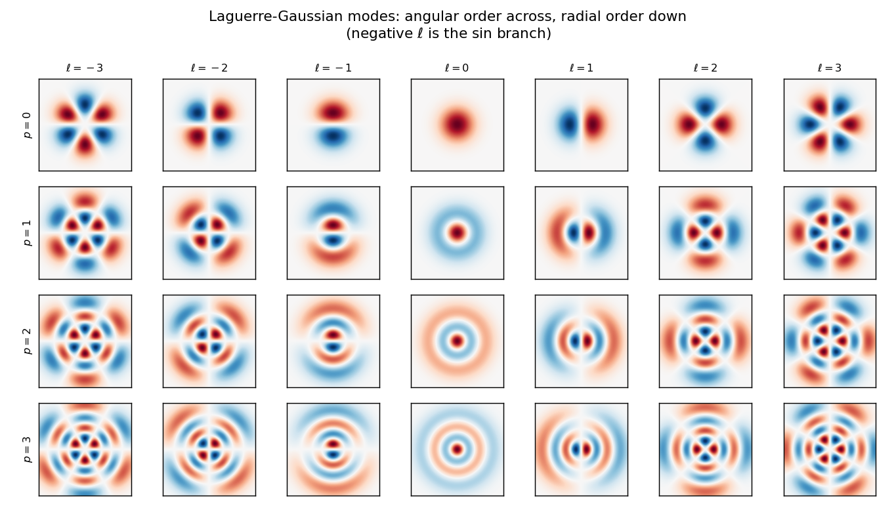

# What a Laguerre-Gaussian mode looks like

Every fit lgpsf produces is a weighted sum of these. Before meeting them as
config vocabulary -- `ShellLadder`, `max_level`, `Mode(p, ell, m)` -- it helps
to see what they are.

A mode is indexed by `(p, ell, m)`: `ell` is the ANGULAR order (how many lobes
go around), `p` the RADIAL order (how many rings go out), and `m` selects among
the `ell`-th harmonics -- in 2-D there are two for each `ell > 0`, the cos and
sin branches. All of them are modulated by the same Gaussian, and they are
orthonormal on R^N.

The energy of a mode is its OSCILLATOR LEVEL, `2p + ell`. That single number
orders the whole basis and is what "level" means everywhere else in the
library: `modes_up_to_level(dim, L)` returns every mode with `2p + ell <= L`.
Cheap, smooth modes first.

## Figures



## Output

```text
            mode  level 2p+ell   max |psi|
  (p=0, ell=0)             0      0.5642
  (p=0, ell=1)             1      0.4839
  (p=0, ell=2)             2      0.4150
  (p=0, ell=3)             3      0.3775
  (p=1, ell=0)             2      0.5642
  (p=1, ell=1)             3      0.4683
  (p=1, ell=2)             4      0.3951
  (p=1, ell=3)             5      0.3554
  (p=2, ell=0)             4      0.5642
  (p=2, ell=1)             5      0.4657
  (p=2, ell=2)             6      0.3909
  (p=2, ell=3)             7      0.3506
  (p=3, ell=0)             6      0.5642
  (p=3, ell=1)             7      0.4649
  (p=3, ell=2)             8      0.3891
  (p=3, ell=3)             9      0.3493
modes_up_to_level(2, 0) -> 1 modes
modes_up_to_level(2, 1) -> 3 modes
modes_up_to_level(2, 2) -> 6 modes

wrote examples/lg_modes.png
```

## Program

```python
import argparse
import os

import numpy as np

import lgpsf

P_MAX, ELL_MAX = 3, 3
HALF_WIDTH, RESOLUTION = 4.0, 161


def mode_grid(p, ell, half_width=HALF_WIDTH, resolution=RESOLUTION):
    """One mode sampled on a square, as a (resolution, resolution) image.

    `eval_lg` is the 2-D reference form and takes the two coordinates
    separately, as flat arrays; the sign of `ell` picks the branch (positive =
    cos, negative = sin). For real work use `eval_lg_basis`, which evaluates a
    whole mode SET at once and shares the work between modes.
    """
    axis = np.linspace(-half_width, half_width, resolution)
    u1, u2 = np.meshgrid(axis, axis, indexing="ij")
    return lgpsf.eval_lg(p, ell, u1.ravel(), u2.ravel()).reshape(u1.shape)


def main():
    parser = argparse.ArgumentParser(description=__doc__)
    parser.add_argument("--outdir", default="examples",
                        help="where to write figures")
    args = parser.parse_args()

    print(f"{'mode':>16}  {'level 2p+ell':>12}  {'max |psi|':>10}")
    for p in range(P_MAX + 1):
        for ell in range(ELL_MAX + 1):
            field = mode_grid(p, ell)
            print(f"  (p={p}, ell={ell})  {2 * p + ell:>12}  "
                  f"{np.abs(field).max():>10.4f}")

    # The library's own enumeration, in the order a ShellLadder walks it.
    for level in range(3):
        modes = lgpsf.modes_up_to_level(2, level)
        print(f"modes_up_to_level(2, {level}) -> {len(modes)} modes")

    try:
        import matplotlib
    except ImportError:
        print("\n(matplotlib not installed -- skipping the figure)")
        return
    matplotlib.use("Agg")
    import matplotlib.pyplot as plt

    columns = list(range(-ELL_MAX, ELL_MAX + 1))
    fig, axes = plt.subplots(P_MAX + 1, len(columns),
                             figsize=(1.5 * len(columns), 1.5 * (P_MAX + 1)))
    for row, p in enumerate(range(P_MAX + 1)):
        for col, ell in enumerate(columns):
            field = mode_grid(p, ell)
            limit = np.abs(field).max()
            ax = axes[row, col]
            ax.imshow(field.T, origin="lower", cmap="RdBu_r",
                      vmin=-limit, vmax=limit)
            ax.set_xticks([]); ax.set_yticks([])
            if row == 0:
                ax.set_title(f"$\\ell={ell}$", fontsize=9)
            if col == 0:
                ax.set_ylabel(f"$p={p}$", fontsize=9)
    fig.suptitle("Laguerre-Gaussian modes: angular order across, "
                 "radial order down\n(negative $\\ell$ is the sin branch)")
    fig.tight_layout()
    path = os.path.join(args.outdir, "lg_modes.png")
    fig.savefig(path, dpi=130)
    print(f"\nwrote {path}")


if __name__ == "__main__":
    main()
```

---

*Generated by `docs/generate_examples.py` from [`examples/lg_modes.py`](../../examples/lg_modes.py); the output and figures above come from actually running it.*
