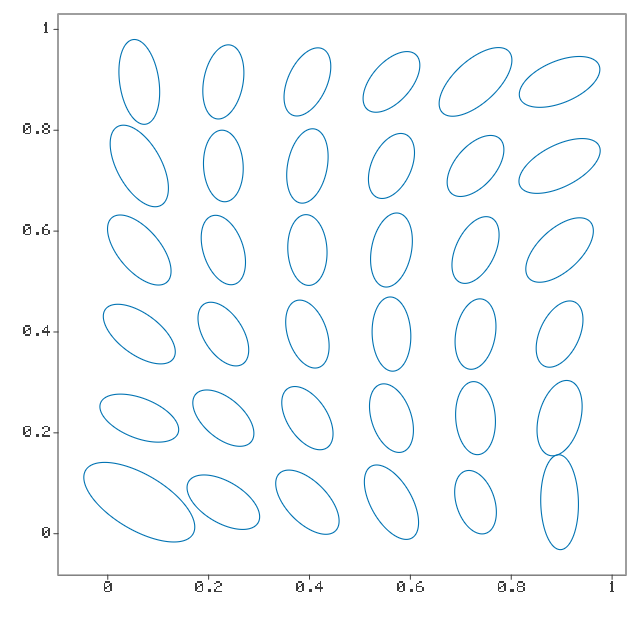
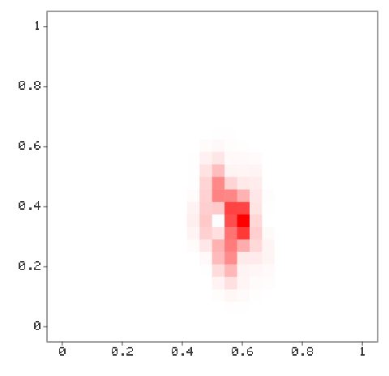
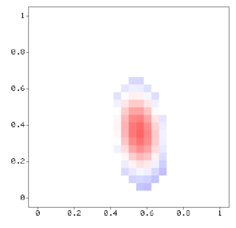

# Fit a whole operator from random matvecs -- the complete pipeline in C++

The same example as `operator_fit_frog.py`, against the same problem, so the
two can be compared directly. Build a known dense operator, hand
`fit_operator` nothing but random probes and their responses, and measure
what comes back.

The steps are the whole product surface:

  1. supply the geometry, the masses and an a-priori ellipsoid field
  2. fit_operator                          -- one call, threaded over rows
  3. read the diagnostics                  -- who shipped, and how well
  4. deploy: matvec / assemble_sparse      -- the fit as an operator

Figures come from ellipsoid_tree's plot2d, which lgpsf already depends on,
so there is no plotting dependency to install.

BUILD THIS OPTIMIZED. A Debug build is not slow, it is unusable: the same
run takes 79 seconds at -O3 and 43 MINUTES with no optimization, because
every row fit is dense linear algebra through Eigen expression templates.
Configure with -DCMAKE_BUILD_TYPE=Release before timing or running anything
here. Then, from the repository root (it writes PNGs into examples/):

    ./build-release/examples/operator_fit_frog

## Figures









## Output

```text
building the frog operator on a 24 x 24 grid (576 dofs) ...

    k   rel. Frobenius   modes/row   rows fit
   10           0.6395         1.0        554
   20           0.5253         5.2        572
   45           0.1320        14.8        572
  110           0.0297        27.8        576

wrote examples/operator_fit_frog_cxx_*.png
```

## Program

```cpp
#include <cstdio>
#include <string>
#include <vector>

#include "ellipsoid_tree/plot2d.hpp"
#include "lgpsf/operator_fit.hpp"

#include "frog_kernel.hpp"

namespace et = ellipsoid_tree;

namespace
{

constexpr int kGrid = 24;
const std::vector<int> kBudgets = {10, 20, 45, 110};
constexpr int kImpulseRow = 13 * kGrid + 8;    // a target away from the boundary

/// Fit the operator from `num_probes` random matvecs.
lgpsf::OperatorFit fit_at( const frog::Problem& problem, int num_probes )
{
    const auto [V, HV] = frog::probes(problem, num_probes);

    lgpsf::OperatorFitConfig config;
    config.tau_window = 3.0;
    config.spike = false;              // mesh-resolved kernel; no spike needed
    config.row.mode_policy = std::make_shared<lgpsf::ShellLadder>(
        std::vector<int>{0, 1, 2, 3, 4, 5, 6});
    config.row.target_score = std::nullopt;   // never exit early; sweep the ladder

    return lgpsf::fit_operator(problem.x, problem.mass, problem.mass, V, HV,
                               problem.sigma, config);
}

/// Draw a nodal field on the grid as one filled cell per point.
void draw_field( et::Plot2D& fig, const frog::Problem& problem,
                 const Eigen::VectorXd& values, double limit )
{
    const double h = problem.spacing;
    for ( Eigen::Index i = 0; i < values.size(); ++i )
    {
        // Diverging blue-white-red: zero is white, so the kernel's negative
        // lobes read as clearly as its positive core.
        const double t = 0.5 * (1.0 + std::max(-1.0, std::min(1.0, values(i) / limit)));
        et::Style style;
        style.stroke = et::colors::transparent();
        style.stroke_width = 0.0;
        style.fill = et::Color{t < 0.5 ? 2.0 * t : 1.0,
                               1.0 - std::abs(2.0 * t - 1.0),
                               t < 0.5 ? 1.0 : 2.0 * (1.0 - t), 1.0};

        // Cells overlap by a hair, or antialiasing leaves seams between them.
        const double r = 0.52 * h;
        et::Box cell;
        cell.lo = Eigen::Vector2d(problem.x(i, 0) - r, problem.x(i, 1) - r);
        cell.hi = Eigen::Vector2d(problem.x(i, 0) + r, problem.x(i, 1) + r);
        fig.add(cell, style);
    }
}

} // namespace

// Figures go to `examples/` unless a directory is given as argv[1]; the
// documentation generator passes a scratch directory.
int main( int argc, char** argv )
{
    std::setvbuf(stdout, nullptr, _IONBF, 0);   // report progress as it happens
    const std::string outdir = ( argc > 1 ) ? argv[1] : "examples";
    std::printf("building the frog operator on a %d x %d grid (%d dofs) ...\n",
                kGrid, kGrid, kGrid * kGrid);
    const frog::Problem problem = frog::build_problem(kGrid);
    const double truth_norm = problem.H.norm();

    std::printf("\n%5s  %15s  %10s  %9s\n", "k", "rel. Frobenius", "modes/row", "rows fit");
    std::vector<lgpsf::OperatorFit> fits;
    std::vector<Eigen::VectorXd> impulse_rows;
    for ( int k : kBudgets )
    {
        lgpsf::OperatorFit fit = fit_at(problem, k);

        // Deploy: assemble the fitted operator and compare against the truth.
        const Eigen::SparseMatrix<double> A = lgpsf::assemble_sparse(
            fit.model, std::numeric_limits<double>::infinity());
        const Eigen::MatrixXd dense(A);
        const double error = (dense - problem.H).norm() / truth_norm;
        impulse_rows.push_back(dense.row(kImpulseRow).transpose());

        const std::vector<int> rows = lgpsf::model_rows(fit.model);
        double modes = 0.0;
        for ( int rho : rows ) { modes += static_cast<double>(fit.model.row_modes(rho).size()); }
        int shipped = 0;
        for ( auto status : fit.diagnostics.status )
        {
            if ( status == lgpsf::RowStatus::Fit ) { ++shipped; }
        }

        std::printf("%5d  %15.4f  %10.1f  %9d\n", k, error,
                    rows.empty() ? 0.0 : modes / static_cast<double>(rows.size()), shipped);
        fits.push_back(std::move(fit));
    }

    // ---- the fitted point-spread function at one target -------------------
    // A ROW of H is a PSF: one model, evaluated over every source. It is what
    // the fitter represents, so it is what the eye should judge.
    const double limit = problem.H.row(kImpulseRow).cwiseAbs().maxCoeff();
    {
        et::Plot2D fig;
        draw_field(fig, problem, problem.H.row(kImpulseRow).transpose(), limit);
        fig.save_png(outdir + "/operator_fit_frog_cxx_truth.png", 480);
    }
    for ( std::size_t i = 0; i < fits.size(); ++i )
    {
        et::Plot2D fig;
        draw_field(fig, problem, impulse_rows[i], limit);
        fig.save_png(outdir + "/operator_fit_frog_cxx_k"
                     + std::to_string(kBudgets[i]) + ".png", 480);
    }

    // ---- the fitted ellipsoid field ---------------------------------------
    // ellipsoid_field hands back exactly what ellipsoid_tree consumes, which is
    // what makes the fit a geometric object and not just a pile of numbers.
    {
        const auto [mu, Sigma] = lgpsf::ellipsoid_field(fits.back().model);
        et::Plot2D fig;
        et::Style style;
        style.stroke = et::colors::blue();
        style.stroke_width = 1.1;
        // Every fourth node in each direction: the field is smooth, and drawing
        // all 576 one-sigma ellipses just fills the square with ink.
        for ( int i = 1; i < kGrid; i += 4 )
        {
            for ( int j = 1; j < kGrid; j += 4 )
            {
                const int rho = i * kGrid + j;
                if ( !fits.back().model.has_model(rho) ) { continue; }
                et::Ellipsoid E;
                E.mu = mu.row(rho).transpose();
                E.Sigma = Sigma[static_cast<std::size_t>(rho)];
                fig.add(E, 1.0, style);
            }
        }
        fig.save_png(outdir + "/operator_fit_frog_cxx_ellipsoids.png", 640);
    }

    std::printf("\nwrote %s/operator_fit_frog_cxx_*.png\n", outdir.c_str());
    return 0;
}
```

---

*Generated by `docs/generate_examples.py` from [`examples/operator_fit_frog.cpp`](../../examples/operator_fit_frog.cpp); the output and figures above come from actually running it.*
