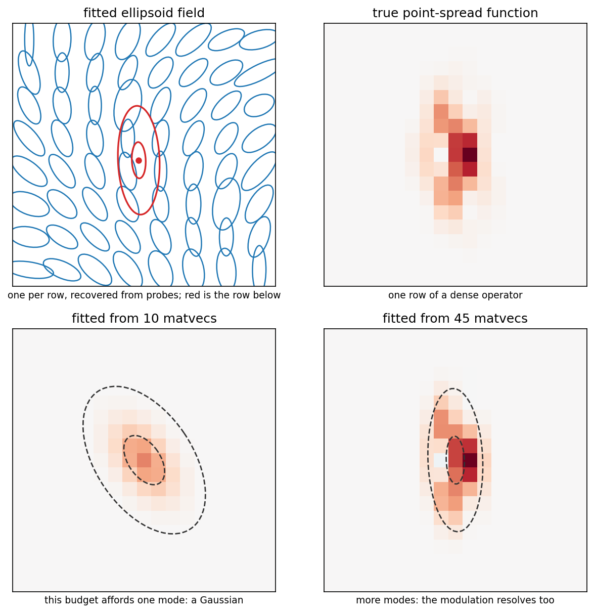
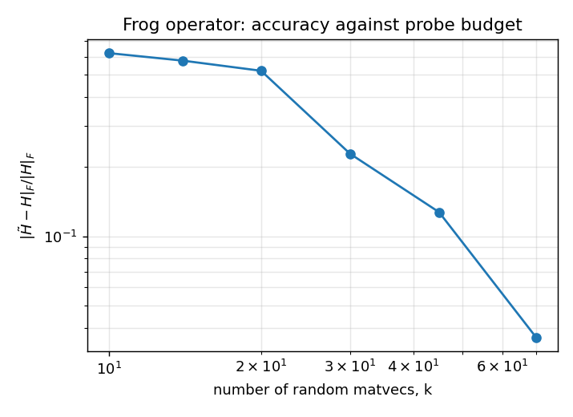
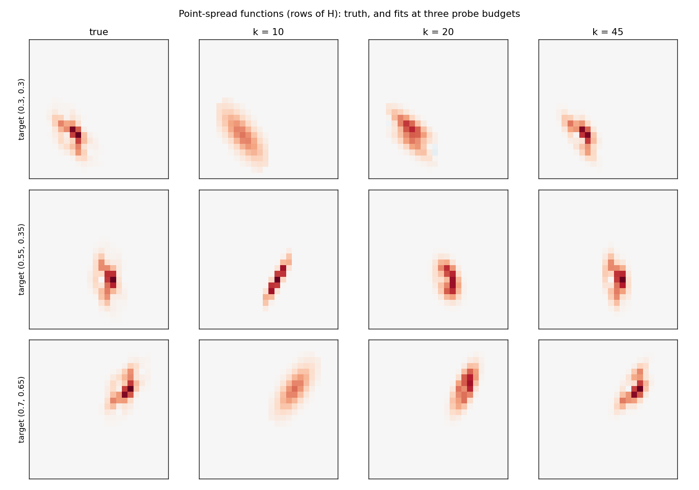

# Fit a whole operator from random matvecs, and watch the error fall with k

This is the end-to-end example: build a known dense operator, hand `fit_operator`
nothing but random probes and their responses, and compare. It is also the
library's integration test -- everything from the harmonic table to the sparse
assembly runs, on a problem that is entirely self-contained.

The target is the rotating frog kernel from `frog_kernel.py`, which the other
examples share. The fitter never sees its matrix; it sees `V` (random probes)
and `HV = H @ V`.

`operator_fit_frog.cpp` is this same example in C++, against the same problem.

## Figures







## Output

```text
building the frog operator on a 24 x 24 grid (576 dofs) ...

    k   rel. Frobenius   modes/row   rows fit
   10           0.6214         1.0        553
   14           0.5766         2.4        554
   20           0.5211         5.1        574
   30           0.2277         9.6        573
   45           0.1271        14.9        573
   70           0.0365        27.2        575

wrote examples/operator_fit_frog_convergence.png
wrote examples/operator_fit_frog_impulses.png
wrote examples/hero.png
```

## Program

```python
import argparse
import os

import numpy as np

import lgpsf
from frog_kernel import build_problem, probes


def fit_at(problem, num_probes, tau_window=3.0, max_level=8, seed=None):
    """Fit the operator from `num_probes` random matvecs and assemble it."""
    V, HV = probes(problem, num_probes, seed)

    config = lgpsf.OperatorFitConfig()
    config.tau_window = tau_window
    config.spike = False          # the kernel is mesh-resolved; no spike needed
    config.row.mode_policy = lgpsf.ShellLadder(list(range(max_level + 1)))
    config.row.target_score = None

    fit = lgpsf.fit_operator(problem["x"], problem["mass"], problem["mass"],
                             V, HV, problem["sigma"], config=config)
    approx = np.asarray(lgpsf.assemble_sparse(fit.model, np.inf).todense())
    return fit, approx


def relative_frobenius(approx, H):
    return np.linalg.norm(approx - H, "fro") / np.linalg.norm(H, "fro")


# ---------------------------------------------------------------------------
# The counting rule sets a floor on k. With the center pinned in 2-D the row
# fit spends P = 3 parameters, and a mode set of size m is admissible only when
# k >= 2 (m + P). So k = 5 cannot fit even ONE mode, k = 10 affords one, k = 20
# affords six. That is why the small budgets below start at 10 rather than 5.
# ---------------------------------------------------------------------------

# `max_level = 8` above leaves 45 modes reachable, so at the top of this range
# the ladder is not the binding constraint -- the probe budget is, which is what
# the curve is meant to show.
CONVERGENCE_K = [10, 14, 20, 30, 45, 70]
DEFAULT_GRID = 24                # resolved regime already; see
                                 # experiments/mesh-scalability.md
HERO_GRID = 40                   # the README figure wants finer pixels
IMPULSE_K = [10, 20, 45]
HERO_K_LOW = 10                  # affords one mode, so the fit is a Gaussian
HERO_K_HIGH = 45                 # affords enough modes to resolve the shape
HERO_TARGET = (0.50, 0.50)   # central, so the zoom window stays inside the domain
HERO_HALF_WIDTH = 0.38           # contains the widest 3-sigma ellipse, and fits the domain
IMPULSE_TARGETS = [(0.30, 0.30), (0.55, 0.35), (0.70, 0.65)]


def _ellipse_patches(center, covariance, taus, **style):
    """One patch per tau: the ellipse {x : (x-mu)^T Sigma^-1 (x-mu) <= tau^2}."""
    from matplotlib.patches import Ellipse
    values, vectors = np.linalg.eigh(covariance)
    angle = np.degrees(np.arctan2(vectors[1, 1], vectors[0, 1]))
    return [Ellipse(center, 2 * tau * np.sqrt(values[1]),
                    2 * tau * np.sqrt(values[0]), angle=angle, **style)
            for tau in taus]


def hero_figure(problem, fits, approx, grid, path="docs/hero.png"):
    """The README figure: what is fitted, what it targets, and what comes out.

    Four panels, arranged so the idea lands before any label is read. The
    ellipse the method fits appears in every one of them, which is what ties
    them together: it is a member of the field in the first panel, and the
    thing the expansion is built on in the last two.

    `fits` and `approx` are keyed by probe budget. Two are shown because the
    mode count the counting rule affords is what changes between them: at the
    smaller budget the fit is a single mode, and therefore a Gaussian on the
    fitted ellipse; at the larger one it has the modes to resolve the
    modulation as well. Both are usable products -- a one-mode fit is cheap and
    is often enough for a preconditioner -- so the panels report what each
    budget buys rather than ranking them.
    """
    import matplotlib.pyplot as plt

    x = problem["x"]
    rho = int(np.argmin(np.linalg.norm(x - np.array(HERO_TARGET)[:, None], axis=0)))

    fig, axes = plt.subplots(2, 2, figsize=(8.4, 8.2))
    good = fits[HERO_K_HIGH]

    # ---- (1,1) the ellipsoid field, with our row picked out ---------------
    mu, sigma = lgpsf.ellipsoid_field(good.model)
    ax = axes[0, 0]
    step = max(1, grid // 7)
    for i in range(step // 2, grid, step):
        for j in range(step // 2, grid, step):
            r = i * grid + j
            if not good.model.has_model(r) or r == rho:
                continue
            for patch in _ellipse_patches(mu[r], sigma[r], [1.0],
                                          facecolor="none",
                                          edgecolor="#1f77b4", linewidth=1.2):
                ax.add_patch(patch)
    # The row the other three panels are about.
    for patch in _ellipse_patches(mu[rho], sigma[rho], [1.0, 3.0],
                                  facecolor="none", edgecolor="#d62728",
                                  linewidth=1.6):
        ax.add_patch(patch)
    ax.plot(*mu[rho], "o", color="#d62728", markersize=5, zorder=5)
    ax.set_xlim(0, 1); ax.set_ylim(0, 1); ax.set_aspect("equal")
    ax.set_xticks([]); ax.set_yticks([])
    ax.set_title("fitted ellipsoid field", fontsize=12)
    ax.set_xlabel("one per row, recovered from probes; red is the row below",
                  fontsize=9)

    # ---- the three field panels, sharing a zoom and a color scale ---------
    center = x[:, rho]
    window = (center[0] - HERO_HALF_WIDTH, center[0] + HERO_HALF_WIDTH,
              center[1] - HERO_HALF_WIDTH, center[1] + HERO_HALF_WIDTH)
    truth = problem["H"][rho, :].reshape(grid, grid)
    limit = np.abs(truth).max()

    panels = [
        (axes[0, 1], truth, None, "true point-spread function",
         "one row of a dense operator"),
        (axes[1, 0], approx[HERO_K_LOW][rho, :].reshape(grid, grid),
         fits[HERO_K_LOW], f"fitted from {HERO_K_LOW} matvecs",
         "this budget affords one mode: a Gaussian"),
        (axes[1, 1], approx[HERO_K_HIGH][rho, :].reshape(grid, grid),
         fits[HERO_K_HIGH], f"fitted from {HERO_K_HIGH} matvecs",
         "more modes: the modulation resolves too"),
    ]
    for ax, field, fit, title, note in panels:
        ax.imshow(field.T, origin="lower", extent=(0, 1, 0, 1), cmap="RdBu_r",
                  vmin=-limit, vmax=limit, interpolation="nearest")
        if fit is not None:
            # This fit's OWN ellipse -- the two budgets disagree about it, and
            # seeing that is the point of showing both.
            fit_mu, fit_sigma = lgpsf.ellipsoid_field(fit.model)
            for patch in _ellipse_patches(
                    fit_mu[rho], fit_sigma[rho], [1.0, 3.0], facecolor="none",
                    edgecolor="#333333", linewidth=1.3, linestyle="--"):
                ax.add_patch(patch)
        ax.set_xlim(window[0], window[1]); ax.set_ylim(window[2], window[3])
        ax.set_aspect("equal")
        ax.set_xticks([]); ax.set_yticks([])
        ax.set_title(title, fontsize=12)
        ax.set_xlabel(note, fontsize=9)

    fig.tight_layout()
    fig.savefig(path, dpi=150, bbox_inches="tight")
    print(f"wrote {path}")


def main():
    parser = argparse.ArgumentParser(description=__doc__)
    parser.add_argument("--quick", action="store_true",
                        help="small grid, two budgets, no figures")
    parser.add_argument("--hero", action="store_true",
                        help="only the README figure: one fit, one image")
    parser.add_argument("--grid", type=int, default=None)
    parser.add_argument("--outdir", default=None,
                        help="where to write figures; overrides the defaults "
                             "(examples/ for the sweep figures, docs/ for the "
                             "README hero)")
    args = parser.parse_args()

    if args.quick:
        grid, budgets = 20, [10, 45]
    else:
        grid = args.grid or (HERO_GRID if args.hero else DEFAULT_GRID)
        budgets = CONVERGENCE_K

    if args.hero:
        # Regenerating the README image should not cost the whole sweep --
        # only the two budgets it actually shows.
        print(f"building the frog operator on a {grid} x {grid} grid ...",
              flush=True)
        problem = build_problem(grid=grid)
        fits, approx = {}, {}
        for k in (HERO_K_LOW, HERO_K_HIGH):
            fits[k], approx[k] = fit_at(problem, k)
            print(f"  k = {k:>3}: relative Frobenius "
                  f"{relative_frobenius(approx[k], problem['H']):.4f}", flush=True)
        import matplotlib
        matplotlib.use("Agg")
        hero_figure(problem, fits, approx, grid,
                    path=os.path.join(args.outdir or "docs", "hero.png"))
        return

    print(f"building the frog operator on a {grid} x {grid} grid "
          f"({grid**2} dofs) ...", flush=True)
    problem = build_problem(grid=grid)

    print(f"\n{'k':>5}  {'rel. Frobenius':>15}  {'modes/row':>10}  {'rows fit':>9}")
    errors, keep, hero_fits = [], {}, {}
    for k in budgets:
        fit, approx = fit_at(problem, k)
        error = relative_frobenius(approx, problem["H"])
        errors.append(error)
        if k in IMPULSE_K:
            keep[k] = approx          # reused below rather than refitted
        if k in (HERO_K_LOW, HERO_K_HIGH):
            hero_fits[k] = fit
        modeled = [rho for rho in range(problem["count"])
                   if fit.model.has_model(rho)]
        modes = np.mean([len(fit.model.row_modes(rho)) for rho in modeled])
        shipped = int((fit.diagnostics.status == int(lgpsf.RowStatus.Fit)).sum())
        print(f"{k:>5}  {error:>15.4f}  {modes:>10.1f}  {shipped:>9}", flush=True)

    assert errors[-1] < errors[0], "more probes should not make it worse"
    if args.quick:
        print("\nquick check passed")
        return

    try:
        import matplotlib
    except ImportError:
        print("\n(matplotlib not installed -- numbers above are the whole "
              "result; install it for the figures)")
        return
    matplotlib.use("Agg")
    import matplotlib.pyplot as plt

    outdir = args.outdir or "examples"
    fig, ax = plt.subplots(figsize=(5.5, 4.0))
    ax.loglog(budgets, errors, "o-")
    ax.set_xlabel("number of random matvecs, k")
    ax.set_ylabel(r"$\|\tilde{H} - H\|_F / \|H\|_F$")
    ax.set_title("Frog operator: accuracy against probe budget")
    ax.grid(True, which="both", alpha=0.3)
    fig.tight_layout()
    path = os.path.join(outdir, "operator_fit_frog_convergence.png")
    fig.savefig(path, dpi=130)
    print(f"\nwrote {path}")

    # A ROW of H is the point-spread function at that target -- one model,
    # evaluated over every source. It is what the fitter represents, so it is
    # what the eye should judge.
    fig, axes = plt.subplots(len(IMPULSE_TARGETS), len(IMPULSE_K) + 1,
                             figsize=(3.1 * (len(IMPULSE_K) + 1),
                                      2.9 * len(IMPULSE_TARGETS)))
    for row, target in enumerate(IMPULSE_TARGETS):
        i = int(np.argmin(np.linalg.norm(
            problem["x"] - np.array(target)[:, None], axis=0)))
        truth = problem["H"][i, :].reshape(grid, grid)
        limit = np.abs(truth).max()
        for col, (title, field) in enumerate(
                [("true", truth)]
                + [(f"k = {k}", keep[k][i, :].reshape(grid, grid))
                   for k in IMPULSE_K]):
            ax = axes[row, col]
            ax.imshow(field.T, origin="lower", extent=(0, 1, 0, 1),
                      cmap="RdBu_r", vmin=-limit, vmax=limit)
            ax.set_xticks([]); ax.set_yticks([])
            if row == 0:
                ax.set_title(title)
            if col == 0:
                ax.set_ylabel(f"target {target}")
    fig.suptitle("Point-spread functions (rows of H): truth, and fits at "
                 "three probe budgets")
    fig.tight_layout()
    path = os.path.join(outdir, "operator_fit_frog_impulses.png")
    fig.savefig(path, dpi=130)
    print(f"wrote {path}")

    hero_figure(problem, hero_fits, keep, grid,
                path=os.path.join(args.outdir or "docs", "hero.png"))


if __name__ == "__main__":
    main()
```

---

*Generated by `docs/generate_examples.py` from [`examples/operator_fit_frog.py`](../../examples/operator_fit_frog.py); the output and figures above come from actually running it.*
